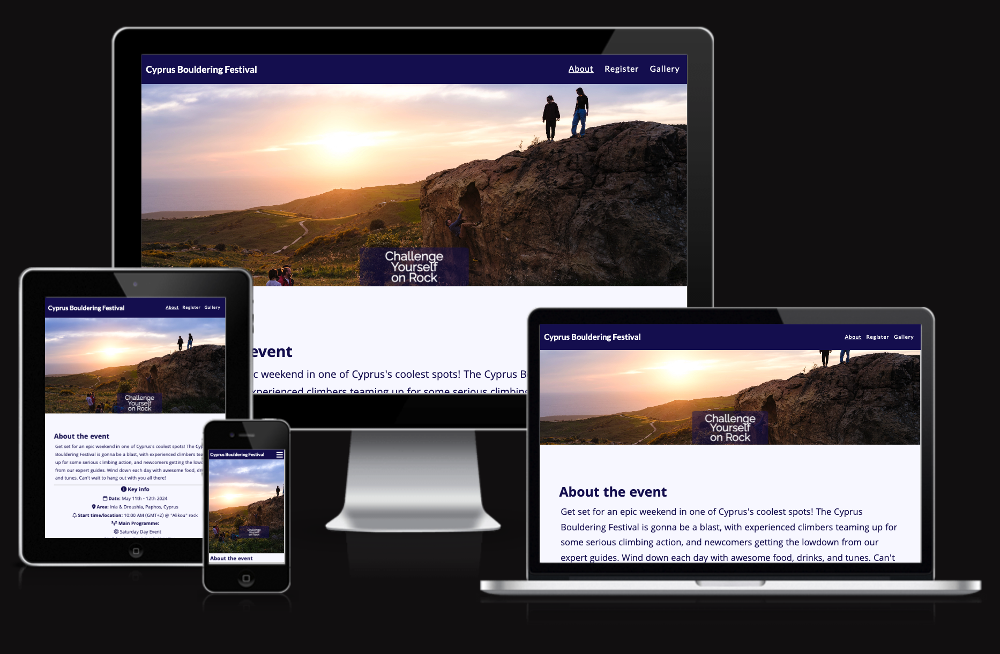
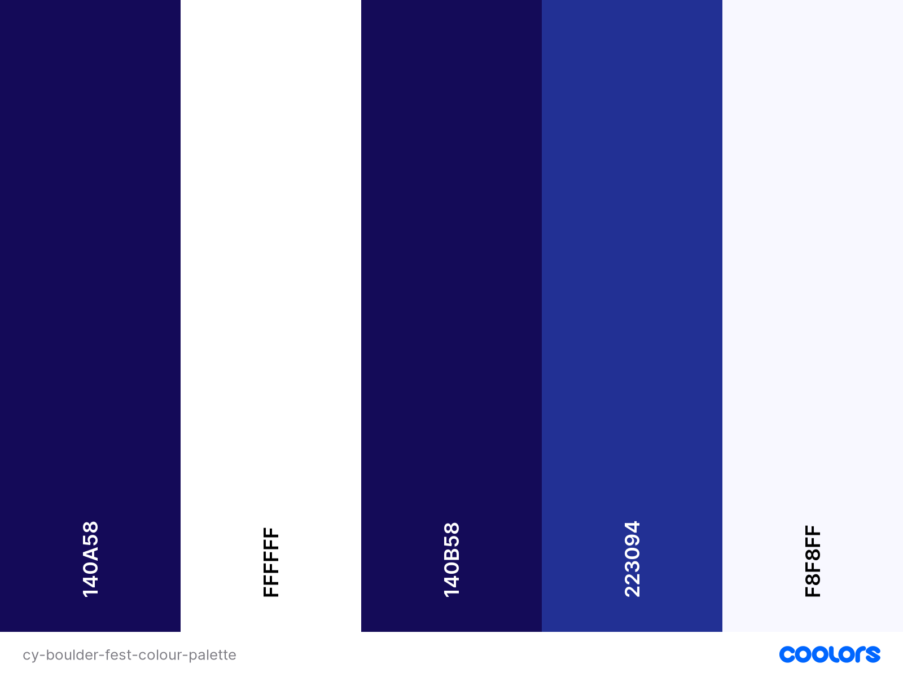

# CYPRUS BOULDERING FESTIVAL

The Cyprus Bouldering Festival is the only outdoor bouldering event in Cyprus, geared towards climbers of all abilities. It includes a friendly competition for more experienced climbers and an "Intro to Bouldering" session for beginners. It is an annual event organised in the western part of Cyprus, in the area around the villages of Inia and Droushia in the Paphos region.

This website informs the user about the key information for this year's festival. It aims to instil a feeling of excitement, adventure and passion about the event. The user can register for the event, detailing their preference in the main activity, as well as view photos from past events to get a more complete view of the type of activities and fun that this festival holds for the participant.

Prospective participants or sponsors can get in touch via the contact links in the footer as well as staying up to date with news, via the social media links.

[View the Live website](https://dimispapa.github.io/cy_boulder_fest/)

## UX Design
The design follows an analysis done using the five Ss: Strategy, Scope, Features, Structure, Skeleton, Surface.
The following key elements considered in the design process:

### Strategy

#### Business goals:

* Increase awareness, reach and visibility of the festival to help establish a brand image.
* Eliminate manual steps in registration and establish a more robust process
* Eliminate competition scoring submission and counting of results

#### User needs:
* Central source of key info on the festival
* Ease of registration and submission of competition scoresheet
* Understand what the event entails through images and social media posts
* Post-event engagement through announcement of competition results, sharing of photos/videos and other social media posts

#### Analysis:

| Opportunity/Problem  | Importance (scale 1-5) | Viability/Feasibility |
| ------------- | ------------- | ------------- |
| Create online presence  | 5  | 5
| Refine registration process  | 4  | 5
| Automate comp scoresheet | 2 | 1
| Showcase past-event photos | 3 | 5
| Integrate with FB event page | 1 | 3

### Scope

#### Usage Scenarios

1. Potential Festival Participant:
    * Wants to quickly arrive to and extract event information
    * Register their participation smoothly without too much hussle
    * Assess whether they would like to join, based on descriptions, photos and climbing level requirement
    * Get in touch to volunteer or ask further details

2. Potential Sponsor
    * Get an initial understanding of the event and if that relates with their business
    * Get in touch to discuss potential collaboration

#### Selected Features
1. About Event / Key Information landing page with inspiring hero image and event flyer
2. Registration Form with clear options (Competition vs Intro to Bouldering session)
3. Gallery page with photos of past events (to be enriched with more photos from future events)

#### Features assessed but Not selected due to resource constraints
1. Competition Scoresheet Submission form
2. Integrated Facebook event page with updates

### Structure

#### Main Audience:
Climbers or Outdoor enthusiasts with mixed IT skills/experience. Highlights importance for simplicity and clear layout with clear purpose and emphasis on key information and registration.

#### Principles of organisation:
Basic linear structure directing the user in the following order of actions:
1. Inform themselves about the event through the index/about landing page.
2. Decide if they want to register straight away through following the links on the index page.
3. If not, can assess further by visiting the Gallery page, at which point they can access the registration form through the "sticky" navigation menu.

### Skeleton
1. Index page:
    * hero image/text clearly setting the tone of event. Sunset vibe with a group of climbers having fun; portraying the beauty of the area and the challenge of rock climbing/bouldering.
    * Catchy/captivating intro paragraph enticing the user to read on further.
    * About section with listed key info with the use of icons instead of bullet points.
    Clearly representing the subject of each list item to help the user to quickly direct their attention to the info they are seeking
2. Gallery page:
    * Carefully selected photos to showcase the various parts of the event: community feel, beauty of nature, challenge of climbing hard, night gathering and past competition winners for inspiration.
3. Registration page:
    * A clear and not excessive registration form with the necessary required fields and option to select participation to the Competition (if experienced) or the Introductory session (if beginner).

### Colour Scheme
The colour scheme is based upon the event flyer colour palette, which was designed by a friend designer and climber, Alexander Tellalis. The colours were picked using the colour picker from Chrome Dev Tools. These work well to combine with lighter shades of the main electric blue used for the header/footer. Combined with white, it works well with the sky and sea elements of the hero image.

The following colours were defined in the CSS stylesheet:
- `#140a58` (main body text colour, header/footer background colour, link/submit button colours)
- `white` (header/footer text, hero text, registration form text, link/submit button text)
- `rgb(20 11 88 / 50%)` (transparent box colour - used for hero text box and registration form)
- `#223094` (colour used when hovering over link/submit buttons)
- `ghostwhite` (main body background colour)

To visualise these using a palette for the purposes of documentation, I have used [coolors.co](https://coolors.co/140a58-ffffff-140b58-223094-f8f8ff).

### Typography
An initial exploration was done with [Google Fonts](https://fonts.google.com/) where Lato was chosen as a font for primary headers. To explore this further, [fontjoy.com](https://fontjoy.com/) was utilised to generate font pairings.

* [Lato](https://fonts.google.com/specimen/Lato) was used for primary headers.
* [Raleway](https://fonts.google.com/specimen/Lato) was used for secondary headers.
* [Khula](https://fonts.google.com/specimen/Khula) was used for main body text.

I used [Font Awesome](https://fontawesome.com/) icons to symbolise the following:
* Social media icons.
* Contact icons for phone and email.
* Key info list icons replacing the bullet points.

## Wireframes
Wireframes were developed using [Balsamiq](https://balsamiq.com/wireframes) for mobile, tablet and laptop/desktop screen sizes.

### Mobile Wireframes

Click here to see the Mobile Wireframes

PLACEHOLDER

### Tablet Wireframes

Click here to see the Tablet Wireframes

PLACEHOLDER

### Laptop/Desktop Wireframes

Click here to see the Desktop Wireframes

PLACEHOLDER

## Features

This website has three main pages and all of them can be accessed via the navigation bar, which is fixed as "sticky" at the top of each page. An additional 404.html page was used for the "404 not found error", when the user tries to access a page that does not exist within our website, which gives the user the option to return to the homepage.

### Current Features
#### Navigation bar
#### Footer with social media and contact links
#### Hero image
#### Responsive Flyer image
#### Interactive link buttons
#### Gallery
#### Registration form
#### Error 404 page

### Future Features
* Comp Submission Scoresheet and Score calculator
* Integrated Facebook event page with posts feed

## Tools & Tech Stack utilised
* HTML was utilised for the main site architecture and content.
* CSS was utilised mainly for styling, design, layout and limited interactivity.
* Git was utilised for version control (stage, commit, push).
* CodeAnywhere was used as the cloud-based IDE for developing code.
* GitHub was utilised for storing the pages resources in a secure cloud depository.
* GitHub Pages was utilised for the live deployment of the website.
* Chrome DevTools was used to help experiment with CSS styling and debug issues.
* Balsamiq was a tool used to design wireframes.
* ChatGPT4 was used to assist with general queries and to aid with understanding of the various options available in HTML/CSS.

## Testing

## Deployment

## Credits

## Acknowledgements
