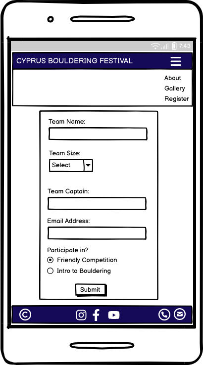
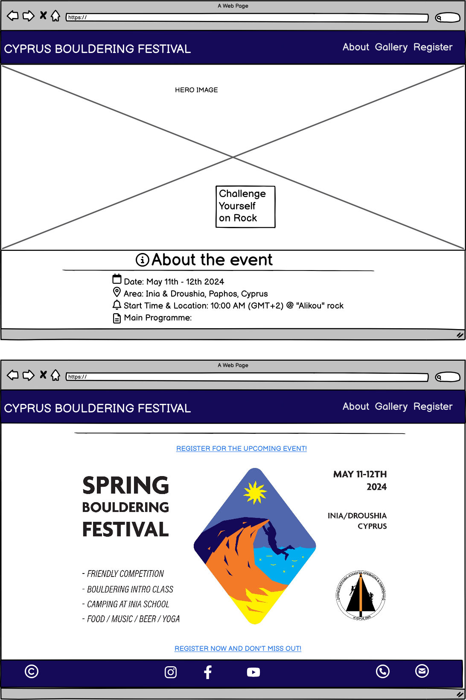
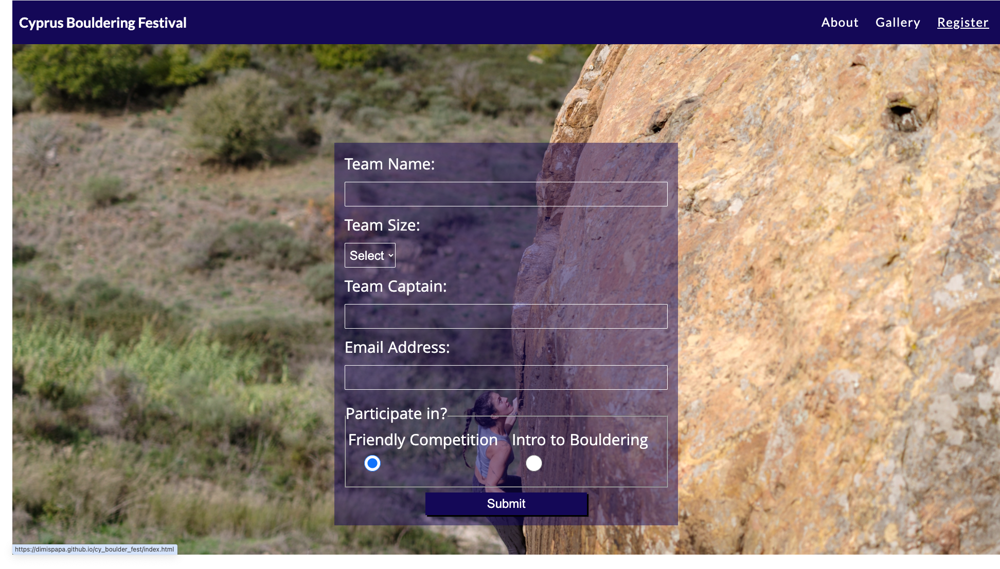

# CYPRUS BOULDERING FESTIVAL

The Cyprus Bouldering Festival is the only outdoor bouldering event in Cyprus, geared towards climbers of all abilities. It includes a friendly competition for more experienced climbers and an "Intro to Bouldering" session for beginners. It is an annual event organised in the western part of Cyprus, in the area around the villages of Inia and Droushia in the Paphos region.

This website informs the user about the key information for this year's festival. It aims to instil a feeling of excitement, adventure and passion about the event. The user can register for the event, detailing their preference in the main activity, as well as view photos from past events to get a more complete view of the type of activities and fun that this festival holds for the participant.

Prospective participants or sponsors can get in touch via the contact links in the footer as well as staying up to date with news, via the social media links.

[View the Live website](https://dimispapa.github.io/cy_boulder_fest/)

## UX Design
The design follows an analysis done using the five Ss: Strategy, Scope, Features, Structure, Skeleton, Surface.
The following key elements considered in the design process:

### Strategy

#### Business goals:

* Increase awareness, reach and visibility of the festival to help establish a brand image.
* Eliminate manual steps in registration and establish a more robust process
* Eliminate competition scoring submission and counting of results

#### User needs:
* Central source of key info on the festival
* Ease of registration and submission of competition scoresheet
* Understand what the event entails through images and social media posts
* Post-event engagement through announcement of competition results, sharing of photos/videos and other social media posts

#### Analysis:

| Opportunity/Problem  | Importance (scale 1-5) | Viability/Feasibility |
| ------------- | ------------- | ------------- |
| Create online presence  | 5  | 5
| Refine registration process  | 4  | 5
| Automate comp scoresheet | 2 | 1
| Showcase past-event photos | 3 | 5
| Integrate with FB event page | 1 | 3

### Scope

#### Usage Scenarios

1. Potential Festival Participant:
    * Wants to quickly arrive to and extract event information
    * Register their participation smoothly without too much hussle
    * Assess whether they would like to join, based on descriptions, photos and climbing level requirement
    * Get in touch to volunteer or ask further details

2. Potential Sponsor
    * Get an initial understanding of the event and if that relates with their business
    * Get in touch to discuss potential collaboration

#### Selected Features
1. About Event / Key Information landing page with inspiring hero image and event flyer
2. Registration Form with clear options (Competition vs Intro to Bouldering session)
3. Gallery page with photos of past events (to be enriched with more photos from future events)

#### Features assessed but Not selected due to resource constraints
1. Competition Scoresheet Submission form
2. Integrated Facebook event page with updates

### Structure

#### Main Audience:
Climbers or Outdoor enthusiasts with mixed IT skills/experience. Highlights importance for simplicity and clear layout with clear purpose and emphasis on key information and registration.

#### Principles of organisation:
Basic linear structure directing the user in the following order of actions:
1. Inform themselves about the event through the index/about landing page.
2. Decide if they want to register straight away through following the links on the index page.
3. If not, can assess further by visiting the Gallery page, at which point they can access the registration form through the "sticky" navigation menu.

### Skeleton
1. Index page:
    * hero image/text clearly setting the tone of event. Sunset vibe with a group of climbers having fun; portraying the beauty of the area and the challenge of rock climbing/bouldering.
    * Catchy/captivating intro paragraph enticing the user to read on further.
    * About section with listed key info with the use of icons instead of bullet points.
    Clearly representing the subject of each list item to help the user to quickly direct their attention to the info they are seeking
2. Gallery page:
    * Carefully selected photos to showcase the various parts of the event: community feel, beauty of nature, challenge of climbing hard, night gathering and past competition winners for inspiration.
3. Registration page:
    * A clear and not excessive registration form with the necessary required fields and option to select participation to the Competition (if experienced) or the Introductory session (if beginner).

### Colour Scheme
The colour scheme is based upon the event flyer colour palette, which was designed by a friend designer and climber, Alexander Tellalis. The colours were picked using the colour picker from Chrome Dev Tools. These work well to combine with lighter shades of the main electric blue used for the header/footer. Combined with white, it works well with the sky and sea elements of the hero image.

The following colours were defined in the CSS stylesheet:
- `#140a58` (main body text colour, header/footer background colour, link/submit button colours)
- `white` (header/footer text, hero text, registration form text, link/submit button text)
- `rgb(20 11 88 / 50%)` (transparent box colour - used for hero text box and registration form)
- `#223094` (colour used when hovering over link/submit buttons)
- `ghostwhite` (main body background colour)

To visualise these using a palette for the purposes of documentation, I have used [coolors.co](https://coolors.co/140a58-ffffff-140b58-223094-f8f8ff).

### Typography
An initial exploration was done with [Google Fonts](https://fonts.google.com/) where Lato was chosen as a font for primary headers. To explore this further, [fontjoy.com](https://fontjoy.com/) was utilised to generate font pairings.

* [Lato](https://fonts.google.com/specimen/Lato) was used for primary headers.
* [Raleway](https://fonts.google.com/specimen/Lato) was used for secondary headers.
* [Khula](https://fonts.google.com/specimen/Khula) was used for main body text.

I used [Font Awesome](https://fontawesome.com/) icons to symbolise the following:
* Social media icons.
* Contact icons for phone and email.
* Key info list icons replacing the bullet points.

## Wireframes
Wireframes were developed using [Balsamiq](https://balsamiq.com/wireframes) for mobile, tablet and laptop/desktop screen sizes.

### Mobile Wireframes

Click here to see the Mobile Wireframes

* About Page

    

* Gallery Page

    

* Registration Page

    

### Tablet Wireframes

Click here to see the Tablet Wireframes

* About Page

    

* Gallery Page

    

* Registration Page

    

### Large Laptop/Desktop Wireframes

Click here to see the Desktop Wireframes

* About Page

    

* Gallery Page

    

* Registration Page

    

## Features

This website has three main pages and all of them can be accessed via the navigation bar, which is fixed as "sticky" at the top of each page. An additional 404.html page was used for the "404 not found error", when the user tries to access a page that does not exist within our website, which gives the user the option to return to the homepage.

### Current Features
#### Navigation bar
The navigation bar is always visible to the user so that an ease of access to all pages is facilitated. 

It is responsive depending on the viewport size. For mobiles and small tablets the menu is hidden under the burger icon as a standard best practice for saving space, with expanding header once clicked. For the larger devices the menu is always visible. When hovering over, the menu becomes bold to improve UX and the current page is underlined.

#### Footer with social media and contact links
The footer contains clickable social media with known icons for Instagram, Facebook and Youtube where the user can open links in new tabs to explore more about the event through posts, photos and videos.

Prospective sponsors/collaborators/participants can also easily get in touch through the contact icons, via phone or email. These are placed at the bottom of the screen as part of the normal flow of the page, once the user has gotten an idea about the event and if they have further queries they need addressed or want to learn more.

#### Hero image
A carefully selected hero image portrays the festival vibe at the golden hour with a group of climbers having fun at a beautiful natural spot, epitomises what the event is about.

The Hero text "Challenge Yourself on Rock" attempts to lure the viewer in to read further and get excited about participating and testing their limits.

#### Responsive Flyer image
Having a three different options of the flyer, it was decided to take advantage of this by applying a responsive picture element where depending on the viewport size and orientation, the browser would pick the appropriate file to render. This does not require the use of media queries in the CSS file, but makes use of embedded media and srcset parameters in the picture element. For instance, for wider screens, the wider version is applied to make use of empty space without distorting the image or taking up too much vertical space.

#### Interactive link buttons
Emphasis has been placed to ensure that the links to the registration page are clearly visible and obvious to the user who is looking to get signed up quickly. A number of links are positioned across the About landing page, with the links above/below the flyer styled as buttons with interactive hover-over feature and shadow to make it more obvious that they are clickable.

#### Gallery
A simple yet powerful Gallery page with quality images has the aim of summarizing at a glance what the event is about, complementing the About page nicely. The gallery is responsive by taking up surplus horizontal space as the viepwort increases, stacking photos in columns in grid-style.

#### Registration form
The registration form is built to only take the minimum required info for a quick and easy sign-up process. Fields that are required are programmed as such and validation is in place for email.

A background image of a climber in action aims to instil further excitement to the user about registering and joining the action.

#### Error 404 page
This page aims to redirect the user back to the main page in case they accidentally enter an invalid URL or page that does not exist. An attempt to make use of some humour and ligh-hearted vibe, even if the user is frustrated that they are trying to access a broken link.

A dark/night-shot picture was chosen to indicate that the user was lost and is looking to get back to the "lighted" boulder.

### Future Features
#### Comp Submission Scoresheet and Score calculator
For this year's event, this has been already developed using Jotform for the electronic submission of scoresheets and feeding that in a Python script that calculates the scores based on a scoring system input file. However to see how we can incorporate this in a more streamlined process as part of this webpage in the future.

#### Integrated Facebook event page with posts feed and Youtube video channel
This was initially part of the possible features in the design phase, however due to lack of time it was decided to focus on the other key features. To include this in the future as well as an integrated Youtube video channel to enrich the UX further.

## Tech Stack & Tools utilised
* **HTML** was utilised for the main site architecture and content.
* **CSS** was utilised mainly for styling, design, layout and limited interactivity.
* **Git** was utilised for version control (stage, commit, push).
* **CodeAnywhere** was used as the cloud-based IDE for developing code.
* **GitHub** was utilised for storing the pages resources in a secure cloud depository.
* **GitHub Pages** was utilised for the live deployment of the website.
* **Chrome DevTools** was used to help experiment with CSS styling and debug issues.
* **Balsamiq** was a tool used to design wireframes.
* **ChatGPT4** was used to assist with general queries and to aid with understanding of the various options available in HTML/CSS.
* **Convertio.co** was utilised to convert jpeg/png images to webp format.

## Testing

### Code Validation

#### HTML

HTML files were validated using the recommended [HTML W3C Validator](https://validator.w3.org).

| Page             | W3C URL     | Screenshot                                                              | Notes                               |
| ---------------- | ----------- | ----------------------------------------------------------------------- | ----------------------------------- |
| About             | [W3C](https://validator.w3.org/nu/?doc=https%3A%2F%2Fdimispapa.github.io%2Fcy_boulder_fest%2Findex.html)|              | Pass: No Errors                     |
| Gallery | [W3C](https://validator.w3.org/nu/?doc=https%3A%2F%2Fdimispapa.github.io%2Fcy_boulder_fest%2Fgallery.html) |  | Pass: No Errors |
| Registration              | [W3C](https://validator.w3.org/nu/?doc=https%3A%2F%2Fdimispapa.github.io%2Fcy_boulder_fest%2Fregistration.html)              |               | Pass: No Errors |             |
| 404              | [W3C](https://validator.w3.org/nu/?doc=https%3A%2F%2Fdimispapa.github.io%2Fcy_boulder_fest%2F404.html)              |               | Pass: No Errors                     |

### CSS

The CSS stylesheet was validated using the recommended [W3C CSS "Jigsaw" Validator](https://jigsaw.w3.org/css-validator).

| File      | Jigsaw URL | Screenshot | Notes | Comment |
| --------- | ---------- | ---------- | ----- | ------- |
| style.css | [Jigsaw](https://jigsaw.w3.org/css-validator/validator?uri=https%3A%2F%2Fdimispapa.github.io%2Fcy_boulder_fest%2F&profile=css3svg&usermedium=all&warning=1&vextwarning=&lang=en) |  | Two identical errors: Property font-optical-sizing doesn't exist : auto | This CSS property does exist as documented by [MDN](https://developer.mozilla.org/en-US/docs/Web/CSS/font-optical-sizing). This style rule is associated with the "Raleway" font properties as pulled from Google Fonts. 

## Lighthouse Audit
A test was carried out on the deployed website, for the relevant areas using the Lighthouse Audit tool:
| Page             | Size    | Screenshot                                                        | Notes               |
| ---------------- | ------- | ----------------------------------------------------------------- | ------------------- |
| About             | Mobile  |  | No major problems  |
| About             | Desktop |     | No major problems   |
| Gallery           | Mobile  |     | No major problems   |
| Gallery           | Desktop |    | No major problems   |
| Registration      | Mobile  |       | Some minor warnings |
| Registration      | Desktop |      | No major problems   |
| 404               | Mobile  |  | No major problems   |
| 404               | Desktop |  | No major problems   |

## Browser Compatibility

The deployed project was tested on Chrome and Safari for compatibility issues.

| Browser | About                                             | Gallery                                                   | Registration                                                 | 404                                                     | Notes             |
| ------- | ------------------------------------------------------ | ------------------------------------------------------------ | ---------------------------------------------------------- | -------------------------------------------------------------- | ----------------- |
| Safari  |   |   |   |   | No issues noted |
| Firefox |  |  |  |  | No issues noted |

## Device Bug Testing - Responsiveness
The website responsiveness and operation was tested on the following physical devices, in addition to testing on Chrome DevTools on a variety of devices:

* iPhone 12 Pro - iOS 17.4.1:
    | About | Gallery | Registration | 404 |
    | ---------- | ---------- | ---------- | ---------- |
    | |    |  | 

Result: Operates as expected

* MacBook Pro 15-inch 2018- macOS Sonoma 14.3.1:
    | About | Gallery | Registration | 404 |
    | ---------- | ---------- | ---------- | ---------- |
    | |    |  | 

Result: Operates as expected

## Deployment
The site was deployed to GitHub Pages. The steps to deploy were as follows:
* Navigate to the "Settings" tab in the [GitHub repository](https://github.com/dimispapa/cy_boulder_fest).
* Go to "Pages" in the "Code and automation" section.
* Under the "Build and deployment" section, select the **Main** branch in the dropdown, ensure the "root" folder is selected, and then click "Save".
* The page will be automatically refreshed with a detailed ribbon display to indicate the successful deployment.
* The page might take a few minutes to be fully deployed and live. Can monitor the "Deployments" ribbon back in the main GitHub repository.

[Click here to view the live deployed website](https://dimispapa.github.io/cy_boulder_fest/)

## Credits

### Technical

| Source                                        | Use                       | Notes                                                  |
| --------------------------------------------- | ------------------------- | ------------------------------------------------------ |
| [Conventional Commits](https://www.conventionalcommits.org/en/v1.0.0/#summary) | Version Control | Help write Git commit messages |
| [Bouldering Favicon by Icons8](https://icons8.com) | Favicon on page head | Multiple resolutions used to avoid rendering issues |
| [Fontjoy](https://fontjoy.com/) | Font Pairing | Used to pair fonts with Lato |
| [Google Fonts](https://fonts.google.com/) | Imported Fonts | Imported in stylesheet |
| [StackOverflow](https://stackoverflow.com/questions/19006653/bullets-in-unordered-list-not-contained-within-the-block) | Lists | Nest bullet points inside container |
| [FontAwesome](https://fontawesome.com/) | Icons | Social media and Contact icons |
| [FontAwesome](https://docs.fontawesome.com/web/style/lists#:~:text=Use%20fa%2Dul%20and%20fa,default%20bullets%20in%20unordered%20lists.&text=You%20can%20also%20keep%20the,but%20use%20icon%20bullets%20visually.) | List Icons | Replace list bullets with icons |
| [GitHub docs](https://docs.github.com/en/get-started/writing-on-github/working-with-advanced-formatting/organizing-information-with-tables) | Readme | How to write tables in markdown |
| [GitHub](https://github.com/adam-p/markdown-here/wiki/Markdown-Cheatsheet#lists)| Readme | Markdown Cheatsheet - general |
| [Rory Patrick Sheridan](https://github.com/Ri-Dearg) | Header | Use of sticky position property |
| [aditus.io](https://www.aditus.io/aria/aria-label/#:~:text=You%20should%20use%20it%20when,technology%2C%20such%20as%20screen%20readers.) | Contact | Use of aria-labels |
| [MDN web docs](https://developer.mozilla.org/en-US/docs/Web/HTML/Element/picture) | Flyer image | use of picture element for responsive img/source application |
| [CI Love Running Walkthrough Project](https://github.com/dimispapa/ci-love_running) | Gallery style | inspiration for the gallery type used |

### Content
| Source | Use | Type | Notes | 
| ----- | --- | ----- | ----- | 
|Silvio Augusto Rusmigo| Hero image, 404 background image, registration background image, gallery (majority of photos) | Photography/Images | All rights reserved - through agreed collaboration for Cyprus Bouldering Guide project |
| Alexander Tellalis | flyer images | Graphic design | All rights reserved - through agreed piece of work |

## Acknowledgements
* I would like to thank my Code Institute mentor, Rory Patrick Sheridan, for the support and useful tips during this project.
* Many thanks to Alex Tellalis for the beautiful flyer he produced for the real event happening soon and the many amazing photos by Silvio Rusmigo that just elevate any content!
* I would like to also thank my partner, Georgina Christou, for the useful views when it comes to the colour scheme and fixing the overall design aesthetics.